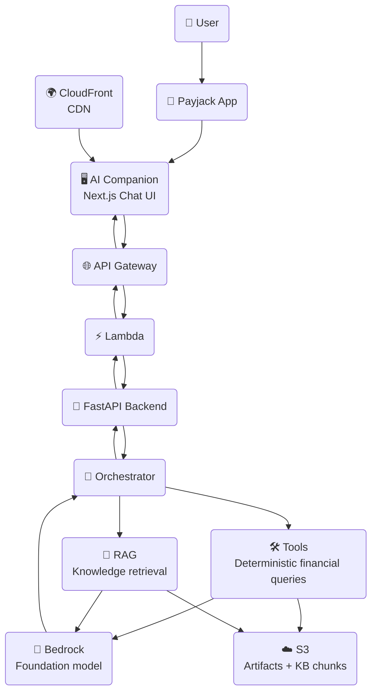

# System Overview

> **Question this diagram answers:** What are the major components of the Payjack AI Companion, and how do they connect?

The Payjack AI Companion is a **read-only, AI-powered advisory layer** embedded inside the Payjack app. It helps users understand their transactions, interpret spending patterns, and navigate app features — without ever sending money, modifying accounts, or providing regulated financial advice.

---

## Component Responsibilities

| Component | Role |
|---|---|
| **Payjack App** | Host application that embeds the AI Companion |
| **Next.js Chat UI** | Chat interface served via CloudFront — single request/response per message, not streamed |
| **CloudFront** | CDN — routes `/*` to S3 frontend, `/api/*` to API Gateway |
| **API Gateway** | HTTP API front door for all backend traffic |
| **Lambda** | Serverless compute running the FastAPI backend as a container |
| **FastAPI Backend** | Handles validation, security, and request routing |
| **Orchestrator** | Classifies intent and coordinates tools, RAG, and Bedrock |
| **Tools** | Deterministic read-only financial data queries — also reachable directly via `POST /tools/invoke`, bypassing the orchestrator and Bedrock entirely |
| **RAG** | Retrieves grounded documentation chunks from the knowledge base |
| **Bedrock** | AWS foundation model — generates natural language responses |
| **S3** | Stores processed financial artifacts and KB embedding chunks |

---

## Design Principles

- **Read-only** — the AI layer never modifies accounts or sends money
- **Grounded** — all responses backed by tools (structured data) or RAG (documentation)
- **PCI-DSS aligned** — PII masking applied before any data reaches the model
- **Observable** — every tool call and LLM invocation is audit-logged
- **Dual entry points** — most traffic flows through the orchestrator (`/chat`), but the frontend's tool-invoke UI can call `POST /tools/invoke` directly for a raw, deterministic tool result with no LLM involved (see [04 — Tool Routing](04-tool-routing.md))

---

*Next: [02 — Runtime Workflow](02-runtime-workflow.md)*
