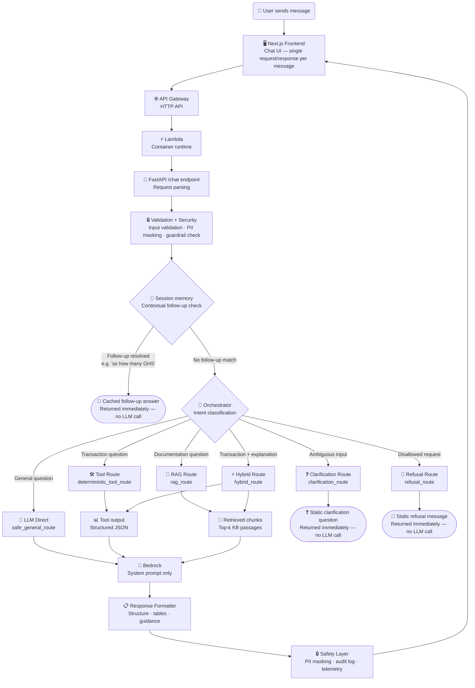

# Runtime Workflow

> **Question this diagram answers:** What happens to a user message from the moment it is sent to the moment a response is returned?

Every request travels through a fixed sequence of layers before any intelligence is applied. A session-memory check runs first to catch short contextual follow-ups; anything else falls through to the orchestrator's intent classification, which determines which of six routes handles the request.

> The frontend's tool-invoke UI can also reach the tools layer directly via `POST /tools/invoke`, skipping this entire request flow (no orchestrator, no Bedrock). See [04 — Tool Routing](04-tool-routing.md).

---

## Route Reference

| Route | Code name | Grounding | LLM called |
|---|---|---|---|
| Session memory follow-up | — (`resolve_contextual_followup`) | Prior turn's structured tool facts | **No** — cached, deterministic answer |
| Tool | `deterministic_tool_route` | Tool output injected into prompt | Yes |
| RAG | `rag_route` | KB chunks injected into prompt | Yes |
| Hybrid | `hybrid_route` | Tool output + KB chunks injected | Yes |
| LLM Direct | `safe_general_route` | System prompt only | Yes |
| Clarification | `clarification_route` | — | **No** — static question |
| Refusal | `refusal_route` | — | **No** — static message |

> `USE_MOCK_BEDROCK=true` replaces all Bedrock calls with a local mock adapter. Applies equally to every LLM route.
>
> Session memory is an in-process, per-`session_id` store of recent turns and tool facts (`backend/app/memory/session_memory.py`) — it is not durable chat history and is lost on Lambda cold start or process restart. See [03 — Orchestrator Workflow](03-orchestrator-workflow.md) for how it fits into the orchestrator's internals.

---

## Safety Layer (applied on every response)

| Step | Purpose |
|---|---|
| PII masking | Removes or redacts customer identifiers before model call and after generation |
| Policy guard | Enforces the read-only, no-advice, no-execution contract |
| Audit logging | Records tool invocations, route taken, and model call metadata |
| Telemetry | Captures latency, token usage, retrieval quality, and error signals |

---

*Previous: [01 — System Overview](01-system-overview.md) · Next: [03 — Orchestrator Workflow](03-orchestrator-workflow.md)*
