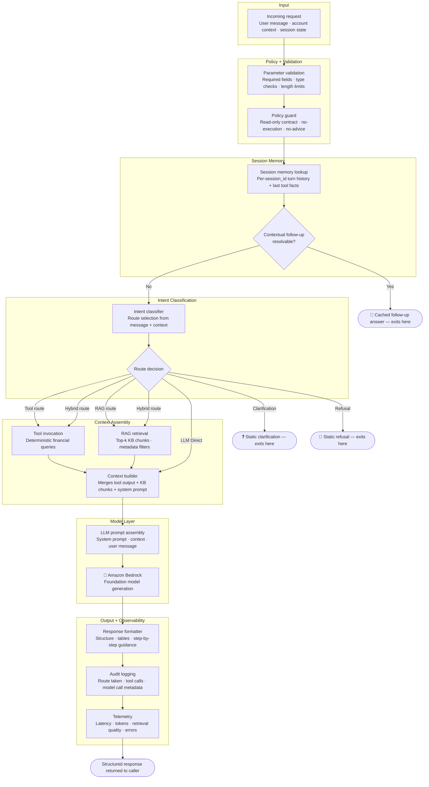

# Orchestrator Workflow

> **Question this diagram answers:** What does the orchestrator do internally between receiving a request and returning a response?

The orchestrator is the coordination engine of the Payjack AI Companion. It is responsible for validating input, enforcing policy, selecting a route, assembling context, calling Bedrock, formatting output, and recording every step for auditing.

---

## Responsibility Boundary

The orchestrator owns two clearly separated concerns:

| Concern | Owned by |
|---|---|
| Route selection, tool calls, RAG retrieval, context assembly, output formatting | **Orchestrator** (deterministic runtime) |
| Natural language generation from assembled context | **Bedrock** (model layer) |

The model never receives raw financial data. It receives only structured, pre-processed context assembled by the orchestrator.

Session memory (`backend/app/memory/session_memory.py`) is intentionally narrow: it holds the last few turns and structured tool facts per `session_id`, in-process only, and is lost on Lambda cold start or restart. It is not durable chat history and never stores free-form assistant text as a source of truth for follow-ups — only structured facts from the last tool-backed response.

Request identity (`user_id`, `tenant_id`, `roles`, `account_ids`) is derived by `AuthContext.from_headers` (`backend/app/security/auth_context.py`) directly from client-supplied headers (`x-payjack-user-id`, `x-payjack-tenant-id`, `x-payjack-roles`, `x-payjack-account-ids`), with no independent verification — the orchestrator trusts whatever the calling application (the Payjack App) asserts. `access_control.py::resolve_account_scope` then restricts any requested `account_ids` to the set already present in that header.

---

## Route Termination Points

Clarification and refusal routes exit **before** any LLM call. They return a static response directly from the orchestrator, which means:

- Zero Bedrock cost for these paths
- Zero hallucination risk for these paths
- Deterministic, auditable outputs for every refused or clarified request

A resolved session-memory follow-up exits even earlier — before intent classification runs at all — and is answered from the last tool-backed response's structured facts rather than from any new tool call or model generation.

---

*Previous: [02 — Runtime Workflow](02-runtime-workflow.md) · Next: [04 — Tool Routing](04-tool-routing.md)*
