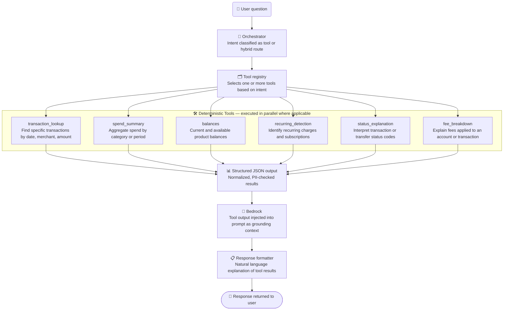
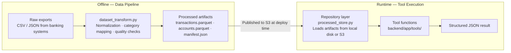

# Tool Routing

> **Question this diagram answers:** How are deterministic financial tools selected and executed, and how do their outputs reach the user?

The tools layer provides structured, deterministic access to processed financial data. Tools are read-only functions that query processed Parquet artifacts loaded by the repository layer. Their outputs are JSON — never raw database records — and are injected into the LLM prompt as grounding context.

> Tools are also reachable directly via `POST /tools/invoke` (`backend/app/api/routes_tools.py`), which returns the raw structured JSON result to the frontend's tool-invoke UI without going through the orchestrator or Bedrock. See [01 — System Overview](01-system-overview.md).

---

## Data Path for Tool Queries

---

## Tool Descriptions

| Tool | Input | Output | Use case |
|---|---|---|---|
| `transaction_lookup` | Date range, merchant, amount filters | Matching transaction records | "Show me my Bolt transactions last week" |
| `spend_summary` | Category, time period | Aggregated totals | "How much did I spend on food in March?" |
| `balances` | Account identifiers | Current and available balances | "What is my wallet balance?" |
| `recurring_detection` | Transaction history | Detected recurring patterns | "What subscriptions am I paying for?" |
| `status_explanation` | Status code or transaction ID | Human-readable explanation | "Why is my transfer still pending?" |
| `fee_breakdown` | Account or product identifiers | Applied fees and charges | "What fees apply to my withdrawal?" |

---

## Key Guarantees

- **Deterministic** — same inputs always produce the same outputs
- **Read-only** — tools never write to any system
- **Auditable** — every tool invocation is recorded in the audit log
- **Isolated** — a customer's actual financial data (balances, transactions, fees charged) is never retrieved via RAG; only tools can return it. RAG's `fees/` knowledge-base category is a separate, distinct source — general fee *policy* documentation (e.g. "what fees exist and why"), never a customer's specific fee history. See [05 — RAG Workflow](05-rag-workflow.md).

---

*Previous: [03 — Orchestrator Workflow](03-orchestrator-workflow.md) · Next: [05 — RAG Workflow](05-rag-workflow.md)*
