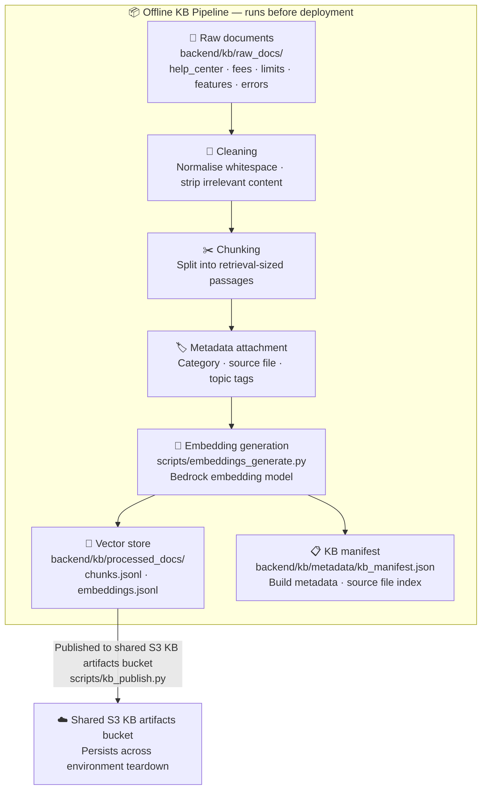
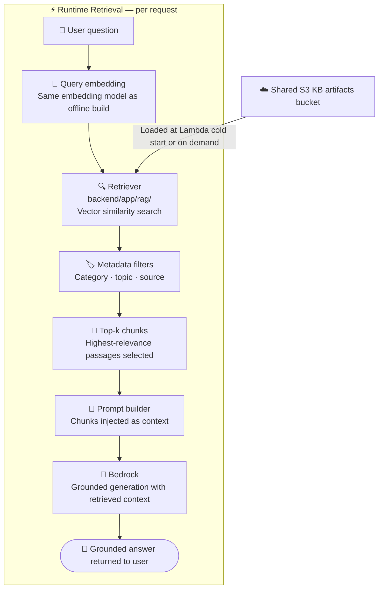

# RAG Workflow

> **Question this diagram answers:** How are documentation chunks prepared offline and retrieved at runtime to ground LLM responses?

RAG (Retrieval Augmented Generation) ensures that answers to documentation questions — fees, limits, feature explanations, error codes — are grounded in Payjack's actual policy and help content, not in the model's parametric knowledge.

The pipeline has two distinct phases: an **offline build phase** that runs before deployment, and a **runtime retrieval phase** that runs per request.

---

## Offline Pipeline — Build Phase

> KB ingestion (`backend/app/rag/kb_builder.py`) is not limited to prose documents. Structured source files are also supported: **CSV** files are chunked one summary chunk plus one chunk per data row, and **Excel workbooks** (`.xls`/`.xlsx`/`.xlsm`, via `pandas`) are chunked one summary chunk per sheet. Both paths flow through the same cleaning, metadata-attachment, and embedding stages as text documents.

---

## Runtime Retrieval Phase

---

## KB Source Categories

| Folder | Content |
|---|---|
| `raw_docs/help_center/` | User support articles, FAQs — wallet, card, transfers, account |
| `raw_docs/fees/` | Fee explanations — transfers, card, withdrawal |
| `raw_docs/limits/` | Transaction and account limits — transfers, ATM, card, wallet |
| `raw_docs/features/` | Product feature documentation — wallet, transfers, card |
| `raw_docs/errors/` | Error code explanations — transfers, authentication, general |

---

## Key Guarantees

- **No financial data in RAG** — KB documents contain no customer-specific or PII information
- **Citeable** — every retrieved chunk has a source and category in its metadata
- **Grounded** — model cannot fabricate policy; it is constrained to retrieved context
- **Shared and persistent** — KB artifacts bucket survives environment teardown

---

*Previous: [04 — Tool Routing](04-tool-routing.md) · Next: [06 — Data Pipeline](06-data-pipeline.md)*
