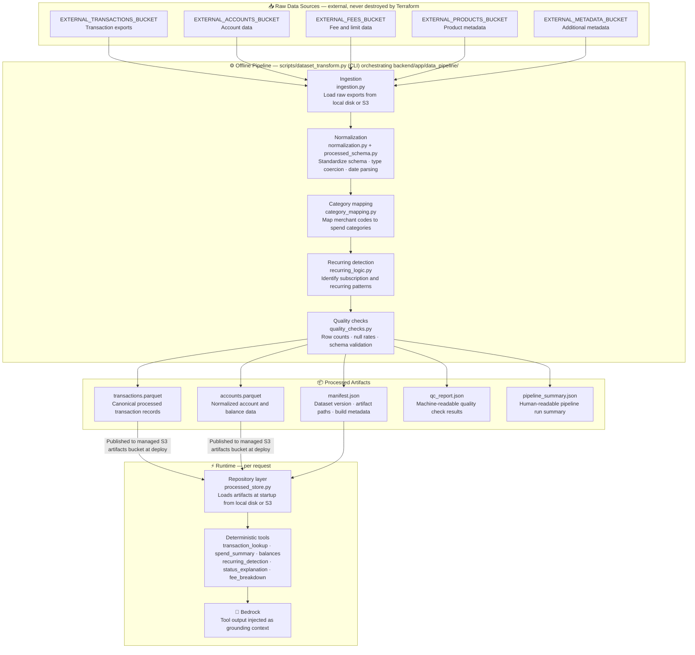

# Data Pipeline

> **Question this diagram answers:** How does raw financial data become the structured artifacts that tool queries run against?

The data pipeline is an **offline process** — it does not run per request. It transforms raw financial exports into standardized, quality-checked Parquet artifacts that the runtime repository layer loads at startup.

---

## Pipeline Flow

> `scripts/dataset_transform.py` is a thin CLI entrypoint — the actual ingestion, normalization, category-mapping, recurring-detection, and quality-check logic lives in `backend/app/data_pipeline/` as importable modules, which the script calls in sequence.

---

## Artifact Reference

| Artifact | Format | Purpose | Consumed by |
|---|---|---|---|
| `transactions.parquet` | Parquet | Canonical processed transactions | Repository layer, tool queries |
| `accounts.parquet` | Parquet | Normalized account and balance records | Repository layer, tool queries |
| `manifest.json` | JSON | Dataset version, artifact paths, source metadata, build info | Repository layer, runtime health, audits |
| `qc_report.json` | JSON | Machine-readable quality check results | Pipeline validation, QA |
| `pipeline_summary.json` | JSON | Human-readable pipeline run summary | Developer inspection, ops review |

---

## Source Mode Switching

The pipeline supports two source modes, controlled by the `--source-mode` flag:

| Mode | When used | Data location |
|---|---|---|
| `local` | Local development | `backend/data/raw/` on disk |
| `s3` | CI/CD deployment | External S3 buckets via `EXTERNAL_*_BUCKET` env vars |

> External raw-data buckets are **never** destroyed by Terraform. The destroy workflow checks that managed bucket outputs do not match any external bucket name before emptying managed buckets.

---

*Previous: [05 — RAG Workflow](05-rag-workflow.md) · Next: [07 — Deployment Workflow](07-deployment-workflow.md)*
