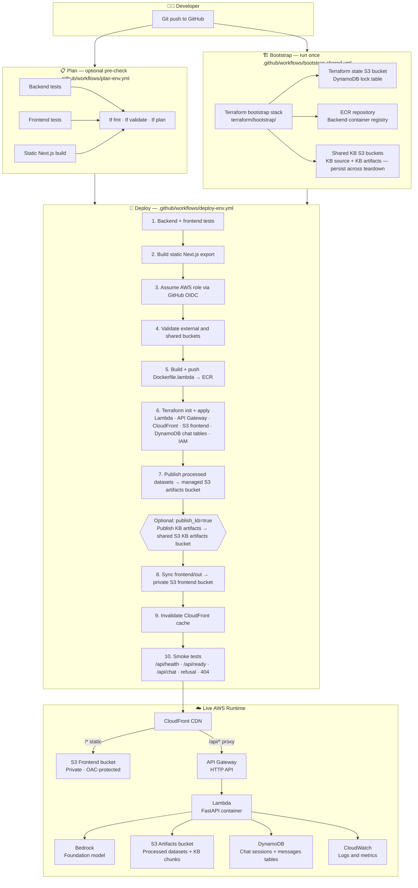

# Deployment Workflow

> **Question this diagram answers:** How does code get from a developer's machine to a running environment on AWS?

Deployment is fully automated through GitHub Actions. There are four distinct workflow files covering bootstrap, plan, deploy, and destroy. The active runtime path is Lambda + API Gateway + CloudFront — not ECS/Fargate.

---

## Deployment Phases



---

## Workflow Reference

| Workflow | File | Trigger | Purpose |
|---|---|---|---|
| Bootstrap | `bootstrap-shared.yml` | Manual — run once | Creates shared resources that outlive environments |
| Plan | `plan-env.yml` | Automatic on pull requests touching `backend/`, `frontend/`, `scripts/`, `terraform/`, or `.github/workflows/` — also manually dispatchable | Validates and plans environment changes |
| Deploy | `deploy-env.yml` | Manual — select `dev`, `test`, or `prod` | Full end-to-end deploy |
| Destroy | `destroy-env.yml` | Manual — requires typing `destroy-<environment>` to confirm | Destroys environment resources only |

---

## Environment Targets

```
dev | test | prod
```

Specify at workflow dispatch. Shared bootstrap resources and external raw-data buckets are never destroyed regardless of target.

---

## What the Destroy Workflow Protects

| Resource | Protected from destroy? |
|---|---|
| Terraform state bucket | Yes — bootstrap-managed |
| Shared KB source bucket | Yes — bootstrap-managed |
| Shared KB artifacts bucket | Yes — bootstrap-managed |
| ECR repository | Yes — bootstrap-managed |
| External raw-data buckets (`EXTERNAL_*`) | Yes — never managed by Terraform |
| Managed processed artifacts bucket | No — destroyed with environment |
| Frontend S3 bucket | No — emptied then destroyed |
| Chat history DynamoDB tables (sessions + messages) | No — destroyed with environment; not bootstrap-managed |

---

*Previous: [06 — Data Pipeline](06-data-pipeline.md) · Next: [08 — AWS Services](08-aws-services.md)*
