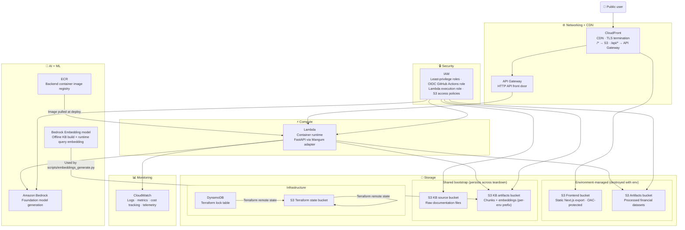

# AWS Services

> **Question this diagram answers:** Which AWS services are in use, what role does each play, and how are they grouped by responsibility?

---

## Services Topology

---

## Service Reference

### Networking

| Service | Role |
|---|---|
| **CloudFront** | CDN and traffic split — `/*` to S3 frontend, `/api/*` to API Gateway. TLS termination. Private S3 origin via OAC. |
| **API Gateway (HTTP API)** | Public API front door. Routes all `/api/*` traffic to the Lambda function. |

### Compute

| Service | Role |
|---|---|
| **Lambda** | Runs the FastAPI backend as a container image. Mangum adapter bridges ASGI to Lambda event format. |

### Storage

| Service | Tier | Role |
|---|---|---|
| **S3 Frontend bucket** | Environment-managed | Hosts the static Next.js export. Private — OAC-protected. |
| **S3 Artifacts bucket** | Environment-managed | Holds processed financial Parquet files loaded at Lambda cold start. |
| **S3 KB source bucket** | Shared / persistent | Stores raw documentation files for the offline KB build pipeline. |
| **S3 KB artifacts bucket** | Shared / persistent | Stores processed KB chunks and embeddings. Per-environment prefix. |
| **S3 Terraform state bucket** | Shared / persistent | Remote state for Terraform runs. |
| **DynamoDB** | Shared / persistent | Terraform state lock table. Prevents concurrent applies. |

### AI + ML

| Service | Role |
|---|---|
| **Amazon Bedrock (LLM)** | Foundation model generation. All four LLM routes call this. Controlled via `BEDROCK_MODEL_ID` — **requires verification**: `backend/app/config.py` defaults to `anthropic.claude-3-5-haiku-20241022-v1:0`, `backend/.env.example` defaults to `eu.amazon.nova-micro-v1:0`, and `.github/workflows/deploy-env.yml` defaults to `amazon.nova-micro-v1:0` — these three should be reconciled to a single source of truth. |
| **Amazon Bedrock (Embeddings)** | Embedding model used by the offline KB build pipeline and at runtime for query embedding. Controlled via `BEDROCK_EMBEDDING_MODEL_ID`. |
| **ECR** | Stores the backend container image built from `backend/Dockerfile.lambda`. Pulled by Lambda at deploy. |

### Security

| Service | Role |
|---|---|
| **IAM** | Least-privilege roles for Lambda execution, S3 access, and Bedrock invocation. GitHub Actions uses OIDC role assumption — no long-lived keys. |

### Monitoring

| Service | Role |
|---|---|
| **CloudWatch** | Receives Lambda logs, runtime telemetry (latency, token usage, retrieval quality), and audit log entries. |

---

*Previous: [07 — Deployment Workflow](07-deployment-workflow.md) · Next: [09 — Folder Architecture](09-folder-architecture.md)*
