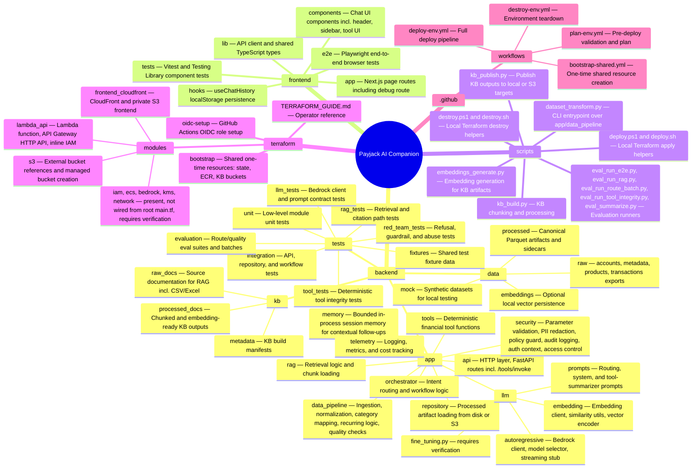

# Folder Architecture

> **Question this diagram answers:** How is the repository organized and what is the responsibility of each major folder?

---

## Repository Tree

---

## Folder Reference

### Backend — `backend/`

| Folder | Purpose |
|---|---|
| `app/api/` | FastAPI HTTP layer — `/health`, `/ready`, `/chat`, and `POST /tools/invoke` (direct tool invocation, bypasses the orchestrator and Bedrock) |
| `app/orchestrator/` | Intent classification, route selection, context assembly, and workflow coordination |
| `app/tools/` | Read-only deterministic financial tool functions (six tools — see [04 — Tool Routing](04-tool-routing.md)) |
| `app/rag/` | Retrieval logic, chunk loading (text, CSV, and Excel sources), and metadata filtering |
| `app/repository/` | Loads processed Parquet artifacts from local disk or S3 |
| `app/llm/autoregressive/` | Bedrock client, model selector, and a `streaming_handler.py` stub — token streaming is not yet implemented |
| `app/llm/embedding/` | Embedding client, similarity utilities, and vector encoding for RAG |
| `app/llm/prompts/` | Routing, system, and tool-summarizer prompt templates |
| `app/llm/fine_tuning.py` | Present in the codebase — purpose and usage require verification |
| `app/data_pipeline/` | Offline ingestion, normalization, category mapping, recurring-pattern detection, and quality-check modules called by `scripts/dataset_transform.py` |
| `app/security/` | Parameter validation, PII redaction, output policy guard, audit logging, header-based `AuthContext`, and account-scope access control |
| `app/memory/` | Bounded, in-process session memory for short contextual follow-ups — not durable, lost on restart/cold start |
| `app/telemetry/` | Latency logging, token tracking, audit events, and cost monitoring |
| `data/raw/` | Original financial exports, split into `accounts/`, `metadata/`, `products/`, `transactions/` |
| `data/processed/` | Normalized Parquet outputs and pipeline sidecars (manifest, QC report, pipeline summary) |
| `data/mock/` | Synthetic datasets for local development and testing |
| `data/embeddings/` | Optional local vector persistence |
| `kb/raw_docs/` | Source documentation files — help center, fees, limits, features, errors — including CSV/Excel sources |
| `kb/processed_docs/` | Chunked and embedding-ready KB files (`chunks.jsonl`, `embeddings.jsonl`) |
| `kb/metadata/` | KB build manifests (`kb_manifest.json`) |
| `tests/` | Test suite — unit, tool integrity, integration, RAG, LLM, red-team, and evaluation |

### Frontend — `frontend/`

| Folder | Purpose |
|---|---|
| `app/` | Next.js page routes — main chat UI and `/debug` route |
| `components/` | Chat UI React components: `app-header`, `chat-shell`, `chat-history-sidebar`, `message-list`, `message-input`, `message-actions`, `response-card`, `tool-menu`, `tool-result-card`, `toast` |
| `hooks/` | `use-chat-history.ts` — localStorage-backed chat history persistence |
| `lib/` | `api.ts` (backend fetch client) and `types.ts` (shared TypeScript interfaces) |
| `e2e/` | Playwright end-to-end browser tests |
| `tests/` | Vitest + Testing Library component and API-client tests |

### Scripts — `scripts/`

| Script | Purpose |
|---|---|
| `dataset_transform.py` | CLI entrypoint that orchestrates `backend/app/data_pipeline/` modules — ingest, normalize, quality-check, output Parquet artifacts |
| `kb_build.py` | Build KB chunks and manifests from raw documentation |
| `embeddings_generate.py` | Generate embedding vectors for KB artifacts |
| `kb_publish.py` | Publish KB outputs to local disk or shared S3 KB buckets |
| `eval_run_e2e.py` / `eval_run_rag.py` / `eval_run_route_batch.py` / `eval_run_tool_integrity.py` | Evaluation runners for end-to-end, RAG, routing, and tool-integrity quality checks |
| `eval_summarize.py` / `chat_eval_common.py` | Shared evaluation helpers and result summarization |
| `deploy.ps1` / `deploy.sh` | Partial Terraform apply helpers for local use when image already exists in ECR |
| `destroy.ps1` / `destroy.sh` | Partial Terraform destroy helpers for local use |

### Infrastructure — `terraform/`

| Folder | Purpose |
|---|---|
| `bootstrap/` | One-time shared stack — Terraform state bucket, DynamoDB lock table, ECR, shared KB S3 buckets |
| `oidc-setup/` | One-time setup of the GitHub Actions OIDC role used for keyless AWS auth |
| `TERRAFORM_GUIDE.md` | Operator-facing Terraform usage guide |
| `modules/lambda_api/` | Lambda function and API Gateway HTTP API wiring; defines the Lambda execution role inline (see below) |
| `modules/frontend_cloudfront/` | CloudFront distribution and private S3 frontend bucket with OAC |
| `modules/s3/` | External bucket references and managed bucket creation |
| `modules/iam/`, `modules/ecs/`, `modules/bedrock/`, `modules/kms/`, `modules/network/` | Present on disk but **not referenced by root `terraform/main.tf`** (which only wires `s3`, `lambda_api`, and `frontend`) — requires verification whether these are vestigial (e.g. from an earlier ECS-based design) or reserved for a future path |

### CI/CD — `.github/workflows/`

| Workflow | Purpose |
|---|---|
| `bootstrap-shared.yml` | Creates shared bootstrap resources — run once per AWS account |
| `plan-env.yml` | Validates infrastructure changes before deploy — runs tests, tf fmt, tf plan |
| `deploy-env.yml` | Full deploy pipeline — test, build, push, apply Terraform, publish artifacts, smoke test |
| `destroy-env.yml` | Destroys environment-managed resources only — protects shared and external buckets |

---

*Previous: [08 — AWS Services](08-aws-services.md) · Next: [10 — End-to-End User Journey](10-end-to-end-user-journey.md)*
