# End-to-End User Journey

> **Question this diagram answers:** What exactly happens — across every layer of the system — when a user asks "Why is my transfer still pending?"

This document traces a single real-world question through the entire stack, from the user's tap to the formatted response on screen.

---

## Full Request Journey

```mermaid
flowchart TD
    A("💬 User taps send\n'Why is my transfer still pending?'")

    subgraph FRONTEND ["🖥️ Frontend — Next.js Chat UI"]
        B["Message dispatched to /api/chat\nPOST with user message + account context"]
    end

    subgraph GATEWAY ["🌐 Gateway Layer"]
        C["CloudFront\n/api/* routed to API Gateway"]
        D["API Gateway\nHTTP API — forwards to Lambda"]
        C --> D
    end

    subgraph BACKEND ["⚡ Backend — FastAPI on Lambda"]
        E["Request parsing\nExtract message · user ID · account IDs"]
        F["Input validation\nRequired fields · length · type checks"]
        G["PII masking\nStrip or redact identifiers before orchestration"]
        E --> F --> G
    end

    subgraph ORCH ["🧠 Orchestrator"]
        H["Intent classification\n'transfer still pending' → transaction question + explanation needed"]
        I["Route selection\nhybrid_route — tool + RAG"]
        H --> I
    end

    subgraph PARALLEL ["Parallel execution"]
        subgraph TOOL ["🛠️ Tool path"]
            J["status_explanation tool\nCounts transactions by status for the account"]
            K["transaction_lookup tool\nRetrieves the specific transfer record"]
            J & K --> L["Structured JSON result\n{ counts_by_status: { pending: 1, ... },\n  records: [{ transaction_id, amount, merchant, category, ... }] }"]
        end
        subgraph RAG ["📄 RAG path"]
            M["Query embedding\nEmbeds 'transfer pending' for similarity search"]
            N["Retriever\nSearches processed KB chunks"]
            O["Metadata filter\ncategory: transfers · topic: status"]
            P["Top-k chunks selected\n'Transfers can remain pending for up to 2 business days...'"]
            M --> N --> O --> P
        end
    end

    subgraph LLM ["🤖 Bedrock — Foundation Model"]
        Q["Prompt assembly\nSystem prompt + tool JSON + RAG chunks + user question"]
        R["Bedrock generation\nGrounded response — no hallucination of policy or status codes"]
        Q --> R
    end

    subgraph SAFETY ["🔒 Safety + Observability"]
        S["Response formatting\nStructured · readable · includes next steps"]
        T["PII masking pass\nEnsure no identifiers in final output"]
        U["Audit log written\nRoute: hybrid · tools called · chunks retrieved · model ID"]
        V["Telemetry recorded\nLatency · token count · retrieval score"]
        S --> T --> U --> V
    end

    subgraph RESPONSE ["💬 Response — Chat UI"]
        W(["User sees:\n'Your transfer is currently pending. This typically happens when the\nrecipient bank is processing the payment. Transfers usually complete\nwithin 2 business days. Your transfer was initiated on [date].'"])
    end

    A --> B --> C
    D --> E
    G --> H
    I --> J & M
    L --> Q
    P --> Q
    R --> S
    V --> W
```

---

## Step-by-Step Narrative

| Step | Layer | What happens |
|---|---|---|
| 1 | Frontend | User sends "Why is my transfer still pending?" — request dispatched to `/api/chat` |
| 2 | CloudFront | `/api/*` routed to API Gateway |
| 3 | API Gateway | HTTP request forwarded to Lambda |
| 4 | FastAPI | Request parsed, validated, PII masked |
| 5 | Orchestrator | Intent classified as transaction question + explanation — route selected: `hybrid_route` |
| 6a | Tools | `status_explanation` and `transaction_lookup` run against processed Parquet data — return structured JSON (see note below on current tool scope) |
| 6b | RAG | Query embedded, KB chunks retrieved and filtered by `category: transfers` — top-k selected |
| 7 | Bedrock | Prompt assembled from system prompt + tool output + KB chunks — generation produces grounded answer |
| 8 | Safety layer | Response formatted, PII masked, audit log written, telemetry captured |
| 9 | Frontend | Structured answer displayed — status code explained, expected resolution time from KB, specific transfer details from tools |

---

## Why Hybrid Route?

This question is a good example of why the hybrid route exists:

- **Tool path** knows the specific transfer's status code, timestamp, and amount — facts that cannot be retrieved from documentation
- **RAG path** knows what that status code means and what the user should expect — policy knowledge the tool does not hold

Neither path alone gives a complete answer. Hybrid merges both.

> **Requires verification:** `status_explanation` (`backend/app/tools/status_explanation.py`) currently returns an aggregate `counts_by_status` distribution filtered by account/date range — it has no `transaction_id` filter and no `code`/`initiated_at` fields, and its own fallback path notes the processed dataset may not include a `status` column at all in some environments. `transaction_lookup`'s `TransactionRecord` likewise has no `status` field. For this worked example, Bedrock must currently synthesize the "why is it pending" explanation from the aggregate status distribution plus the transaction's other fields (amount, merchant, timestamp), rather than from a precise per-transaction status/code/initiated-at lookup as a literal reading of this journey might suggest. Confirm with the team whether a dedicated per-transaction status lookup is planned or whether this narrative should be scoped down to match current tool capability.

- Session memory means that if this exact question were asked again shortly after in the same session, the follow-up could be answered from cached tool facts without a new tool call or Bedrock invocation — see [03 — Orchestrator Workflow](03-orchestrator-workflow.md).
- Independently of session memory, this exchange (the question and Bedrock's formatted answer) is also durably persisted to DynamoDB via `ChatHistoryStore` after step 8, so it later appears in the user's chat history sidebar — this is unrelated to the in-process follow-up cache above and survives Lambda restarts. See [08 — AWS Services](08-aws-services.md).

---

*Previous: [09 — Folder Architecture](09-folder-architecture.md) · Next: [11 — Roadmap: Future Integrations](11-roadmap-future-integrations.md)*
