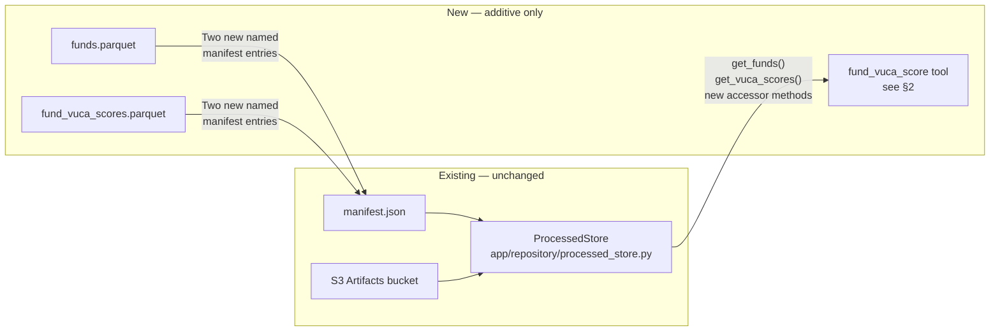
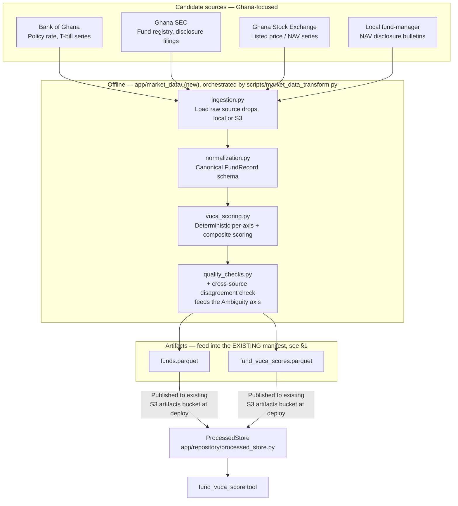
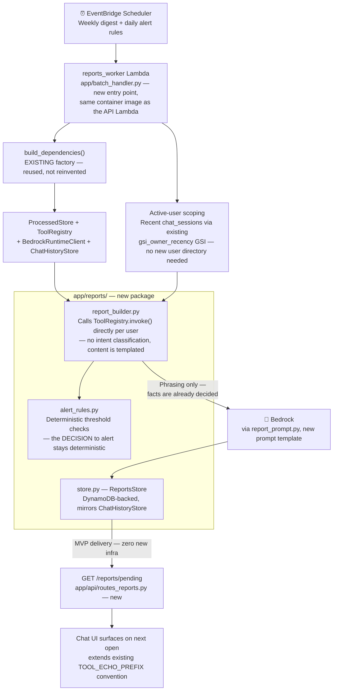

# Roadmap: VUCA Fund Assessment, Market-Data Ingestion, and Agentic Reports/Alerts

> **Status: PROPOSED ROADMAP — not yet built.** Unlike [01](01-system-overview.md) through [10](10-end-to-end-user-journey.md), which document the system as it currently ships, this document describes **target architecture for three new capability areas that do not exist in the codebase today**. Nothing in this file should be read as current behavior.
>
> **Question this document answers:** How would investment-fund risk scoring, external market-data ingestion, and scheduled/agentic reporting plug into the existing Payjack AI Companion build — without breaking its read-only, no-advice, deterministic-tools-first design?

---

## 0. Hard Constraint: Informational Only, Never Advice

Every capability below inherits the same non-negotiable boundary the rest of the system already enforces: **the AI Companion does not recommend, and the VUCA score is not an investment recommendation.** It describes measurable characteristics of a fund (volatility, uncertainty, complexity, ambiguity) so a user can understand a product they already hold or are looking at — it never tells them what to buy, sell, or move money into.

This isn't a new principle bolted on for this feature — it's the existing one. `app/orchestrator/refusal_classifier.py` already has a working `personalized_regulated_financial_advice` category that catches phrasing like "which fund should I buy." Every design decision below (§2, §5) treats extending that guardrail — not inventing a new one — as the correct approach.

---

## 1. Foundational Integration Principle

The single decision the rest of this roadmap depends on: **new market-data artifacts are added as more named entries in the existing artifact manifest, not a parallel system.**

`ProcessedArtifactManifest` (`app/data_pipeline/processed_schema.py`) already models artifacts as a named dict, and `ProcessedStore` (`app/repository/processed_store.py`) already loads them generically from local disk or S3. Adding `funds` and `fund_vuca_scores` as two more entries — alongside the existing `transactions`, `accounts`, `fees_and_limits`, `products`, `metadata` — costs **zero new infrastructure**: no new S3 bucket, no new IAM statement, no second manifest format, no second repository class. This is the load-bearing "how does this connect to the existing build" answer for everything in §2 and §3.

---

## 2. VUCA Fund Assessment

A composite score plus four individual axis scores (0–100 each) for a given fund or liquidity product, computed from established, named financial metrics — never from a black-box heuristic.

### Axis Definitions

| Axis | Candidate metrics | Primary Ghana-based source |
|---|---|---|
| **V**olatility | Historical NAV/price standard deviation (90-day), maximum drawdown (1-year) | Ghana Stock Exchange (GSE) listings, fund-manager NAV bulletins |
| **U**ncertainty | Forecast dispersion across published estimates, macro-indicator variance (rate volatility) | Bank of Ghana policy-rate and T-bill rate series |
| **C**omplexity | Number of underlying holdings, number of distinct fee layers, structural/derivative use | Ghana SEC regulatory filings; fee-layer counting can reuse the *pattern* already used by the existing `fee_breakdown` tool (not its data — that tool is per-user-transaction, this is per-fund-product) |
| **A**mbiguity | Disclosure completeness percentage, cross-source disagreement (same fund/date reported differently by two sources) | Ghana SEC disclosure filings cross-checked against GSE/fund-manager figures |

Each axis is normalized independently and combined into a single composite score, with the four axis scores always surfaced individually alongside the composite — never collapsed into one number without the breakdown, so a user (or the model summarizing it) can see *why* a fund scored the way it did.

### New Deterministic Tool: `fund_vuca_score`

Added as a **7th entry** in `app/tools/registry.py`'s `ToolRegistry.invoke()` dispatch, following the same two-function pattern every existing tool uses (request normalizer + result serializer, mirroring `app/tools/fee_breakdown.py`), and added to the `/tools/invoke` allowlist alongside the other six.

| | |
|---|---|
| **Input** | `fund_id` (or a tuple of IDs for batch lookup), optional `as_of_date` |
| **Output** | `volatility_score`, `uncertainty_score`, `complexity_score`, `ambiguity_score` (0–100 each), `composite_score`, `contributing_metrics` (the raw values behind each score — `nav_stddev_90d`, `max_drawdown_1y`, `forecast_dispersion`, `macro_variance_index`, `holdings_count`, `fee_layer_count`, `disclosure_completeness_pct`, `cross_source_disagreement_pct`), `data_as_of`, `source_count`, `warnings` (staleness flags) |
| **Compute timing** | **Fully precomputed offline** by the market-data pipeline (§3) — the tool itself does zero live computation and zero external calls at request time, exactly like the other six tools only ever read precomputed Parquet |
| **Scope shape** | Unlike the other six tools, this one's subject is a market instrument, not a user's own account — it does not go through `resolve_account_scope`. Worth calling out explicitly during implementation as the first deviation from that pattern. |

### Guardrail and Disclaimer Enforcement

- Extend `refusal_classifier.py`'s existing `personalized_regulated_financial_advice` pattern list with VUCA-specific advice-seeking phrasing (e.g. "should I buy the fund with the lowest score," "is this fund safe based on its score") — reusing the proven mechanism rather than building a second one.
- Every `fund_vuca_score` payload carries a hardcoded `disclaimer_flag`, so the response formatter can enforce disclaimer text is present in the final answer even if the model omits it — the guarantee lives in code, not in prompt-following.
- The scoring methodology itself (weights, normalization method) is versioned and recorded in `manifest.json`/`pipeline_summary.json`, extending the "dataset version, build info" convention those artifacts already carry — so any score is explainable and reproducible on demand, not a black box a compliance reviewer has to take on faith.

---

## 3. Ghana-Focused Market-Data Ingestion (Offline Pipeline)

Mirrors `app/data_pipeline/` module-for-module — a new `app/market_data/` package, run offline via a new `scripts/market_data_transform.py` CLI (sibling to the existing `scripts/dataset_transform.py`), never invoked from the request path.

### Sourcing Caution

Before automating collection from any source above: verify Terms of Service, robots.txt, and licensing per source. Prefer official downloadable tables/CSV/API feeds where a regulator already publishes them (Bank of Ghana typically publishes rate tables directly) over scraping HTML. Where scraping is genuinely the only option, keep it strictly offline/batch, rate-limited, clearly identified, and cached — this pipeline must never run on a live request, exactly like the existing transaction data pipeline never does.

---

## 4. Agentic Weekly Reports & Daily Alerts

Scheduled jobs that reuse the existing deterministic tools and orchestration primitives to proactively surface spending and (later, once §2–§3 land) fund-risk insights — instead of waiting for the user to ask.

### Key Design Choices

- **Alert decisions stay deterministic.** `alert_rules.py` evaluates thresholds (spend spike, low balance, new recurring payment) in plain Python against tool output — the same "tools decide facts, LLM only phrases language" split the rest of the system already uses. The LLM is never the thing deciding whether to alert.
- **Trigger: AWS EventBridge Scheduler**, not GitHub Actions cron, for this specific job — it stays inside the AWS account boundary and can invoke Lambda under a tightly-scoped IAM role without exposing production Bedrock/DynamoDB access to CI runners. (GitHub Actions cron is a reasonable fit for the market-data pipeline in §3 instead — that job is closer in nature to the existing build/deploy batch jobs and isn't sensitive to live user data access.)
- **Compute target: a second, dedicated Lambda** (`reports_worker`, via `app/batch_handler.py`), not the existing API Gateway Lambda — reuses the same container image built from `Dockerfile.lambda` with a different handler, so there's no second build/ECR pipeline, and no HTTP timeout constraint on batch runtime since API Gateway isn't in the path.
- **MVP delivery has zero new infrastructure.** `GET /reports/pending` surfaces unread `ReportsStore` records into the existing chat UI on next open, extending the same convention already used to flag tool-originated messages. SNS push notifications and SES email are real options but both add genuine new product/compliance surface (device token registration; domain verification and an explicit opt-in flow) — deferred to a later phase rather than bundled into the MVP.

---

## 5. New Terraform / Infrastructure

| Resource | Where it goes | Why |
|---|---|---|
| `reports` DynamoDB table (`PAY_PER_REQUEST`, hash key `owner_key`, range key `report_id`) | Added as a third table in the *existing* `terraform/modules/dynamodb/main.tf`, alongside `chat_sessions`/`chat_messages` | Reuses the module and the `gsi_owner_recency` pattern already proven there |
| `reports_worker` Lambda function | New resource in `terraform/modules/lambda_api/main.tf` or a small new `terraform/modules/reports_worker/` module | Same ECR image as the API Lambda, different handler/CMD — no second image pipeline |
| Least-privilege IAM role for `reports_worker` | Own inline `aws_iam_policy_document`, following the exact pattern already in `lambda_api/main.tf` | Scoped to read artifacts bucket, read/write `reports` table, read `chat_sessions`/`chat_messages`, invoke Bedrock — not a reuse of the API Lambda's broader role |
| Two `aws_scheduler_schedule` resources (weekly digest, daily alerts) | New, targeting the `reports_worker` Lambda ARN | Each needs its own scheduler-invocation role scoped to `lambda:InvokeFunction` on that one function |

**Explicitly not reused** — confirmed by direct inspection of the currently-unwired Terraform modules, so this isn't a guess:

- `terraform/modules/bedrock/` is **empty** (no `.tf` files at all) — nothing to redirect to; extend the inline Bedrock IAM statements already in `lambda_api/main.tf` instead.
- `terraform/modules/iam/` provisions an ECS *task* role (`assume_role_policy` for `ecs-tasks.amazonaws.com`) — leftover from an earlier ECS-based design, structurally cannot serve a Lambda execution role.
- `terraform/modules/ecs/` — a scheduled job this size is squarely a Lambda use case; no reason to stand up container orchestration for it.
- `terraform/modules/network/` — the existing API Lambda has no `vpc_config` today; no reason to introduce VPC networking for a batch job that only talks to AWS-managed services.
- `terraform/modules/kms/` — existing tables/buckets rely on default AWS-managed encryption; customer-managed KMS should be an app-wide decision, not special-cased for one feature.

---

## 6. Phased Rollout

| Phase | Scope | Compliance checkpoint |
|---|---|---|
| **1** | Market-data pipeline (§3) + `funds`/`fund_vuca_scores` artifacts published into the existing manifest/bucket — zero new infra | **Here** — before scoring methodology is finalized, since every downstream phase inherits the "informational, never advice" framing and the scoring weights/normalization |
| **2** | `fund_vuca_score` tool + registry/`/tools/invoke` wiring + refusal-classifier extension + disclaimer enforcement (§2) | Review actual refusal patterns and disclaimer copy before this is reachable via chat (direct `/tools/invoke` access could ship slightly earlier since it bypasses the LLM narrative layer entirely) |
| **3** | Reports/alerts foundation — `ReportsStore`, `alert_rules.py`, `report_builder.py`, `app/batch_handler.py` — tested against the existing six tools only, no VUCA dependency. Can run **in parallel** with Phases 1–2. | — |
| **4** | EventBridge Scheduler + `reports_worker` Lambda + Terraform wiring + MVP delivery via `GET /reports/pending` | — |
| **5** | Merge tracks: weekly digests/alerts optionally reference VUCA scores (e.g. "your recurring fund's VUCA composite changed by X") | **Here specifically** — this is the first place VUCA output reaches a user *unprompted* (a push, not a user-initiated lookup), so the no-advice framing needs re-review in that context |
| **6** | SNS/SES delivery channels | Deferred — gated on a separate product/consent-flow decision, not bundled into the MVP |

---

## 7. Dependency Flags

`requirements.runtime.txt` — what's actually deployed to the Lambda — is intentionally minimal today (`fastapi`, `uvicorn`, `mangum`, `boto3`, `pandas`, `pyarrow`, `pydantic`, `requests`, no LLM SDKs, no scraping libraries). Before implementation:

- If any source in §3 requires HTML scraping beyond what plain `requests` + built-in parsing can do, `beautifulsoup4` would need to be **deliberately** added to `requirements.runtime.txt` — it exists today only in the broad personal dev environment (`pyproject.toml`/`uv.lock`), not in what ships.
- `yfinance` (also dev-environment only) is **not applicable** here — it's US-market equity/ETF data and doesn't fit the Ghana-focused sourcing this roadmap targets. Don't pull it in.
- `boto3`, `requests`, `pandas`, `pyarrow` already cover everything the new pipeline and the new Lambda need — `BedrockRuntimeClient` is already boto3-based, so no separate Bedrock SDK is required for the reports job either.
- Confirm the pinned Terraform AWS provider version supports the `aws_scheduler_schedule` resource type (§5) before implementation — it's a comparatively recent addition to the provider.

---

## 8. Relationship to Known Gaps

This roadmap is additive to, not a replacement for, the open items already tracked in [gap-analysis-report.md](gap-analysis-report.md) (the `BEDROCK_MODEL_ID` three-way mismatch, unwired Terraform modules, `fee_breakdown`'s direct-pandas data path, etc.). None of those block starting Phase 1 above, but the `BEDROCK_MODEL_ID` reconciliation in particular is worth resolving before Phase 4, since the new `reports_worker` Lambda will call the same `BedrockRuntimeClient` and should not inherit an already-known configuration ambiguity into a second Lambda.

---

*Previous: [10 — End-to-End User Journey](10-end-to-end-user-journey.md) · Back to [01 — System Overview](01-system-overview.md)*
